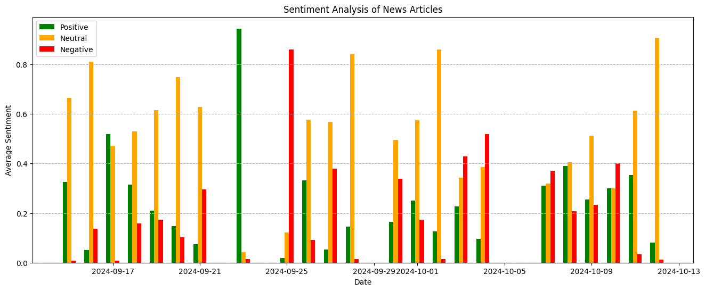

## **3.2 Trực quan hóa điểm cảm xúc**

Bây giờ chúng ta có thể trực quan hóa các điểm cảm xúc. Tuy nhiên, trước khi thực hiện, cần lưu ý rằng có những ngày xuất hiện nhiều bài báo. Nếu cộng trực tiếp các điểm cảm xúc khi có nhiều bài báo trong cùng một ngày, giá trị sẽ bị thổi phồng và tạo ra các đỉnh nhọn (spike) trên biểu đồ. Để khắc phục, chúng ta nên chuẩn hóa các điểm cảm xúc theo số lượng bài báo của mỗi ngày trước khi vẽ biểu đồ. Nhờ chuẩn hóa, biểu đồ sẽ phản ánh chính xác hơn xu hướng cảm xúc chung mà không bị ảnh hưởng bởi số lượng bài báo mỗi ngày. Các đỉnh nhọn sẽ giảm đi và biểu đồ sẽ dễ diễn giải hơn.

Trong đoạn mã sau, chúng ta nhóm các bài báo theo ngày và tổng hợp để có được cả tổng lẫn số lượng bài báo của mỗi ngày. Sau đó, chúng ta chia tổng của từng điểm cảm xúc cho số lượng bài báo của ngày đó để thu được cảm xúc trung bình trong ngày. Cách này chuẩn hóa các điểm số và ngăn việc bị thổi phồng do số lượng bài báo khác nhau. Tiếp theo, chúng ta dùng các điểm cảm xúc đã chuẩn hóa để trực quan hóa.


```python
# Group by date and calculate average sentiment scores
df_grouped = df.groupby('Date').agg(['sum', 'count'])  # Get sum and count

# Create new columns for normalized sentiment scores
df_grouped['avg_positive'] = df_grouped['Sent_positive']['sum'] / df_grouped['Sent_positive']['count']  # Normalize positive
df_grouped['avg_negative'] = df_grouped['Sent_negative']['sum'] / df_grouped['Sent_negative']['count']  # Normalize negative
df_grouped['avg_neutral'] = df_grouped['Sent_neutral']['sum'] / df_grouped['Sent_neutral']['count']  # Normalize neutral

# Convert df_grouped.index to DatetimeIndex
df_grouped.index = pd.to_datetime(df_grouped.index)

# Plot the sentiment data
fig, ax = plt.subplots(figsize=(16, 6))
width = 0.2
ax.bar(df_grouped.index - pd.DateOffset(days=width), df_grouped['avg_positive'], width=width, label='Positive', color='green')
ax.bar(df_grouped.index, df_grouped['avg_neutral'], width=width, label='Neutral', color='orange')
ax.bar(df_grouped.index + pd.DateOffset(days=width), df_grouped['avg_negative'], width=width, label='Negative', color='red')

# Set plot attributes (labels, ticks, title, legend, gridlines)
ax.set_xlabel('Date')
ax.set_ylabel('Average Sentiment')
ax.set_title('Sentiment Analysis of News Articles')
ax.legend()
ax.grid(True, axis='y', linestyle='--')
plt.show()

```



Biểu đồ thu được là biểu đồ cột thể hiện cảm xúc trung bình của các bài báo theo thời gian. Mỗi ngày có ba cột, đại diện cho ba loại cảm xúc: tích cực (xanh lá), tiêu cực (đỏ) và trung lập (cam). Chiều cao của mỗi cột cho biết độ lớn của điểm cảm xúc trung bình thuộc loại đó vào ngày tương ứng. Cột càng cao thì cảm xúc càng mạnh.

Biểu đồ cho phép chúng ta quan sát xu hướng cảm xúc theo thời gian. Chúng ta có thể thấy cảm xúc trung bình thay đổi như thế nào qua các ngày, tức là đang trở nên tích cực hơn, tiêu cực hơn hay giữ ở mức trung lập. Bằng cách so sánh chiều cao các cột của từng loại, chúng ta có thể xác định những giai đoạn có cảm xúc tích cực hoặc tiêu cực mạnh hơn. Chẳng hạn, nếu vào một ngày nào đó cột đỏ (tiêu cực) cao hơn nhiều so với cột xanh lá (tích cực), điều này cho thấy các bài báo của ngày đó nhìn chung mang cảm xúc tiêu cực hơn. Ngược lại, cột xanh lá cao hơn sẽ cho thấy cảm xúc tích cực hơn.
