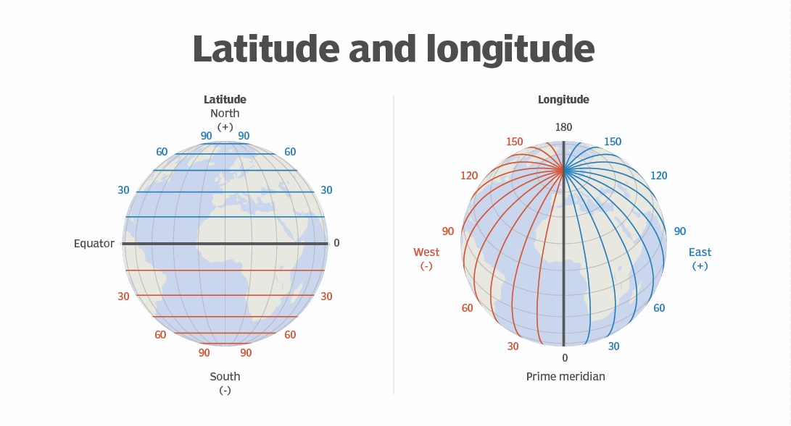
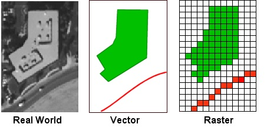
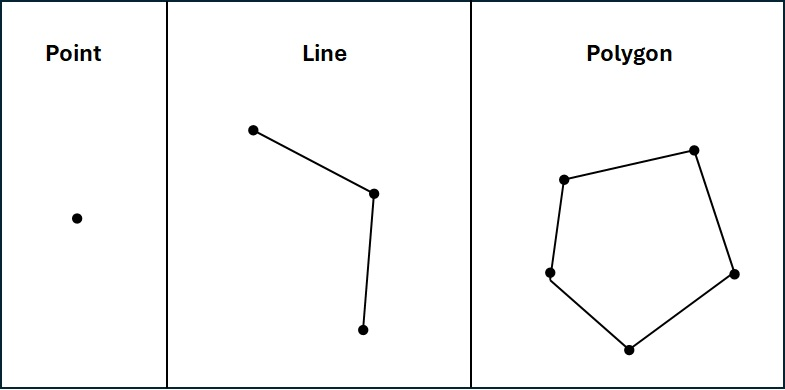

##### MODULE 6 | LESSON 1

# **Geospatial Data**

|  |  |
|:---|:---|
|**Reading Time** |60 minutes|
|**Prior Knowledge** |Basic Python|
|**Keywords** |Geospatial data, raster data, vector data, GIS, CRS
 |
|  |  |

## **1. Introduction**
In this lesson, we are going to introduce geospatial data. This type of data is tagged with location information in the form of a coordinate system. We will go through the basic concepts of geospatial data. Then, we will demonstrate how to use Python to process geospatial data for further analysis. The knowledge we learn from this lesson will also help us study for this module's upcoming lessons on satellite imagery and climate data.
<br>
# **2. Geospatial Data**

## **2.1. What is Geospatial Data?**
**Geospatial Data** is a type of dataset containing information about features on Earth's surface. What is a feature? Things or events we can observe on Earth's surface are called features. For example, a tree, a building, a road, and a river are examples of features. These examples are static features that do not move or change very quickly. Features can also be dynamic, like a car's travel route or the path of a hurricane.
<br>
There are two components of feature information in a geospatial dataset:**feature position** and **feature attributes**.    
<br>
&nbsp;&nbsp;&nbsp;&nbsp;&nbsp;&nbsp;**Feature position** tells us where this feature is located on a coordinate system on Earth's surface. Depending on data types within the geospatial dataset, there are different methods of presenting feature position information. We'll discuss this more later on in this lesson.
<br>
&nbsp;&nbsp;&nbsp;&nbsp;&nbsp;&nbsp;**Feature Attributes** tells us other non-geolocation information, such as a building's height, year built etc. Another example can be a hurricane's speed and pressure at certain time.    
<br>
When discussing feature position, we talked about representing a location on a coordinate system for Earth surface. In the next section, we are going to learn more about the coordinate systems used in geospatial data.
<br>
## **2.2. Geospatial Data in Financial Analysis**
In recent years, applying geospatial data in financial analysis has become more and more popular. Geospatial data can provide different aspects of information about financial activities that traditional financial data cannot provide. Geospatial data links economic outcomes, the movement of people or objects, and natural environment change together. Here are some examples of how to apply geospatial data in financial analysis
<br>
&nbsp;&nbsp;&nbsp;&nbsp;&nbsp;&nbsp;**Insight into the Movement of People and Objects**
<br>
&nbsp;&nbsp;&nbsp;&nbsp;&nbsp;&nbsp;Geospatial data offers greater insight into the movement of both people and objects. For example, by understanding the frequency and timing of customer foot traffic for a retail store, financial analysts can predict sales and make informed decisions about the company's performance.
<br>
&nbsp;&nbsp;&nbsp;&nbsp;&nbsp;&nbsp;**Evaluation of Credit Risk**
<br> Geospatial data can be used by financial institutions to evaluate the risk of underwriting a commercial property loan. It can analyze the repayment histories of adjacent commercial properties.
<br>
&nbsp;&nbsp;&nbsp;&nbsp;&nbsp;&nbsp;**Selection of Bank Branch Location**
<br> By analyzing the movement and shopping routes of a community's residents, a bank can identify the optimal location for a bank branch that will cross most residents' travel routes.
<br>
# **3. Coordinate Reference Systems**
A **coordinate reference system (CRS)** is a coordinate system to describe location information on Earth's surface (Awati, 2022). There are various CRS system frames you can use, but the most popular approach is using latitude and longitude to form a grid system on Earth's surface.
<br>
&nbsp;&nbsp;&nbsp;&nbsp;&nbsp;&nbsp;**Latitude** lines are horizontal lines across the Earth to show how far a location is away from the equator with respect to the directions of north and south. The 0 degree line of latitude is located at the equator. It divides Earth into the Northern Hemisphere above the equator and the Southern Hemisphere below the equator.
<br>
&nbsp;&nbsp;&nbsp;&nbsp;&nbsp;&nbsp;**Longitude** lines are vertical lines across the Earth to show how far a location is away from the prime meridian with respect to directions of west and east. The 0 degree line of longitude is located at the prime meridian. It divides the Earth into the Eastern Hemisphere and the Western Hemisphere. Figure 1 demonstrates this coordinate system.
<br>
<br>
**Figure 1. Earth's Latitude and Longitude Coordinate System**


_Source: TechTarget_
<br>
When referencing a location on a CRS, the general consensus is to start first with latitude and then longitude in the form of (latitude, longitude). There are two ways to present latitude-longitude information. The first method is degrees, minutes, and seconds (DMS). For example, the coordinates using DMS for New York are (40° 43' 50.1960'' N, 73° 56' 6.8712'' W). The ° denotes degree. The ' denotes minute, and the '' denotes second. The second method is decimal degrees (DD). The coordinates using DD for New York are (40.730610, -73.935242).
<br>
There are two main differences between DMS and DD. The first difference is that DMS and DD use different symbols to represent the direction information of a location. DMS uses characters to describe which hemisphere the location is in (N vs S; W vs E). DD uses + and - signs to describe the hemisphere location. In the DMS method, New York's direction coordinates are (N, W). In the DD method, New York's direction coordinates are (+,-). We can use Figure 1 to understand how the DD method assigns +/- signs. On the left part of the figure, we can see that if a location is in the Northern Hemisphere, the latitude sign is +. If the location is in the south, the latitude sign is -. The concept is the same when applied to longitude.
<br>
The second difference is that DMS is in degrees and DD is in decimals. We can easily convert between the two methods. To convert DMS to DD, first we keep the degree number. Then, we divide the minute number by 60 and divide the second number by 3600. We then add the results of the two divisions and add them back to the degree number. The final number will be the number in DD. Sometimes, which hemisphere the data is in is indicated by the variable name or header, and the values of data points are all positive in the table. In this case, we need to manually adjust the values of the data points to properly represent the hemisphere location in the DD method.
<br>
In Python, we will use the DD method to present coordinate information. You can easily find the DD coordinates for a place in Google Maps.
<br>
# **4. Types of Geospatial Data**
In the last section, we introduced the latitude-longitude CRS. In the feature position section, we talked about how different geodata types will use different methods to present location information. There are two main geodata types: raster data and vector data.    
<br>
&nbsp;&nbsp;&nbsp;&nbsp;&nbsp;&nbsp;**Raster data** divides a feature into a grid system. Each grid unit is called a pixel or a cell. Raster data stores feature attributes based on each pixel. In the satellite imagery lesson, we will talk more about raster data.
<br>
&nbsp;&nbsp;&nbsp;&nbsp;&nbsp;&nbsp;**Vector data** stores feature attributes based on feature shape. A feature can have a point shape, a line shape, or a polygon shape. In this lesson, we'll focus on vector data.    
<br>
Before moving on to the next topic of vector data, let's take a look at Figure 2 to get a visual understanding of the difference between the two geodata types.
<br>
**Figure 2. Vector Data vs Raster Data**
<br>

<br>
_Source: CUNY Hunter_
<br>
# **5. Vector Data**
In the previous section, we showed how we can present a location using a CRS. So far, we've only talked about a point location, which means a dot on the latitude-longitude coordinate system. Apart from a point shape, we can also include line shapes and polygon shapes with a CRS. Figure 3 demonstrates examples of a point shape, a line shape, and a polygon shape.    
<br>
**Figure 3. Point, Line, and Polygon Shapes**

<br>
The above three shapes in Figure 3 consist of points and lines. The points are called vertices. The location of each vertex can be represented by a latitude-longitude coordinate pair. By having shape information and vertex coordinate information, we can identify the geospatial location of a feature on a latitude-longitude coordinate system. In vector data, we store the shape information and coordinate information in a variable called **geometry**. It is this geometry variable that differentiates geospatial data from traditional tabular data.
<br> In terms of vector geospatial data format, there are two common data formats: **GeoJSON** and **Shapefile**. The required readings will give a very short introduction to these two data formats.
<br>
# **6. Geospatial Data Source and Analysis Software**
There are several ways to collect geospatial data. Some of the sources that collect data include the Global Positioning System (GPS), wearable devices, mobile phones, remote sensing (satellite), and internet of things (IoT) to name a few.
<br>
After getting geospatial data, researchers usually use a **geographic information system (GIS)** to read and analyze the data. There are many popular paid or free GISs, like ArcGIS or QGIS. These types of software usually have built-in functions to read different types of geospatial data and visualize functions to present the data.

# **7. Application of Geospatial Data**
In this section, we are going to use Python to demonstrate how to pull geospatial data from online data resource, clean the data to be ready for analysis and visualize the data.
<br>
We are going to use Hurricane Irene's path along the east coast of the United States as an example. In late August of 2011, Hurricane Irene caused severe damage to this region of the United States. For example, lower New York City lost electricity for one week as a result of the storm.

In this application, we will pull the hurricane's path and wind data from the National Hurricane Center (NHC) of the National Oceanic and Atmospheric Administration (NOAA). We will pull the data and draw the hurricane's path on a map. In this demonstration, we are also going to illustrate how to overlay different information on a map. We will overlay U.S. state borders on the map to show which states were affected by this hurricane.
<br>
The main Python package to use for geospatial data analysis is geopandas. Geopandas is the geospatial data version of pandas. It can handle the various types of geospatial data we mentioned in previous sections. We then will use the folium package to visualize the hurricane's path. Let's get started.

## **7.1 Load Python Packages**
There are a few packages we will need for this demonstration.

```python
!pip install fiona
```

```python
!pip install geopandas
```

```python
pip install install-jdk
```

```python
import jdk
from jdk.enums import OperatingSystem, Architecture

jdk.install('11', operating_system=OperatingSystem.LINUX)
```

Output:
```
'/root/.jdk/jdk-11.0.25+9'
```

```python
import os
jdk_version = 'jdk-11.0.25+9' #change with your version 
os.environ['JAVA_HOME'] = '/root/.jdk/jdk-11.0.25+9'
os.environ['PATH'] = f"{os.environ.get('PATH')}:{os.environ.get('JAVA_HOME')}/bin"
```

```python
# Import packages for this application
# pandas is used to process dataframe and geopandas is used to process geodataframe
# fiona is used to read or write various formats of geospatial data
# urllib is used to pull data on the internet using url
#zipfile is used to unzip a zipped file
import os
import pandas as pd
import geopandas as gpd
import fiona
import urllib.request
import zipfile
```

## **7.2 Data for Hurricane Irene**
The hurricane path data is in a PDF file. As such, we need to download the tabula package to handle PDF files.

```python
pip install tabula-py

```

```python
# Import tabula package for PDF handling
import tabula
```

Next, let's retrieve the PDF file from the National Hurricane Center website.

```python
# Retrieve PDF file from NHC website
url = "https://www.nhc.noaa.gov/data/tcr/AL092011_Irene.pdf"

irene_pdf, _ = urllib.request.urlretrieve(url)
```

Then, we will use a method from the tabula package to convert a PDF file to a csv file.

```python
# Convert PDF file to csv file, and then a pandas dataframe
tabula.convert_into(irene_pdf, "irene.csv", output_format="csv", stream=True, pages = 9)
irene_1 = pd.read_csv("irene.csv")
irene_1
```

From the last code output, we can see that the second row does not contain data values. They are measurement units/information for each variable. For example, the measurement unit for wind speed is knots (kt). Also, the last row does not have any data values. We are going to drop these two rows.

```python
# Drop rows with measurement units or no data values
irene_1.drop([0,40], inplace = True)
irene_1
```

Next, let's convert numeric variables to float types.

```python
# Correct data types for numeric variables
convert_dict = {'Date/Time': str,
                'Latitude': float,
                'Longitude': float,
                'Pressure': float,
                'Wind Speed': float
                }

irene_1 = irene_1.astype(convert_dict)
print(irene_1.dtypes)

```

Output:
```
Date/Time      object
Latitude      float64
Longitude     float64
Pressure      float64
Wind Speed    float64
Unnamed: 5     object
dtype: object
```

## **7.3 Creating the Date-Time Variable**
Next, we can see that the date/time variable does not contain month and year information. Therefore, we're going to create a new date/time variable to provide complete date/time information.

```python
# Create a new Date Time variable to contain month and year information
irene_1[["Date","Time"]] = irene_1["Date/Time"].str.split(" / ", expand = True)
irene_1["Date_Time"] = "08/" + irene_1["Date"] + "/2011/" + irene_1["Time"]
irene_1.set_index("Date_Time")
irene_1
```

## **7.4 Ensuring Spatial Data is Correct**

We also notice that the data values for longitude in the dataset are all positive. However, the direction for longitude is "W." The numbers for longitude should all be negative based on Figure 1 in section 3. Hence, we need to add a negative sign in front of all numbers for the longitude variable to correctly reflect the location.

```python
# Adjust Longitude value to correctly reflect the geolocation
irene_1['Longitude'] = 0 - irene_1['Longitude']
```

```python
# Select the variables we are interest for next steps
irene_2 = irene_1[["Date_Time","Longitude","Latitude","Wind Speed"]]
```

## **7.5 Converting to a Geodataframe**

Now we have a good dataframe for Hurricane Irene's path. To convert this dataframe to a geospatial dataframe, we need to create a geometry variable, as explained in the previous section. We will use a method from geopandas to create this variable. One of the parameters in the following code is "EPSG:4326", which is the code name for the latitude-longitude system we are familiar with. Remember there are several CRS systems available, but we'll proceed with this commonly used one.

```python
# Create a geolocation variable
geometry = gpd.points_from_xy(irene_2.Longitude, irene_2.Latitude, crs="EPSG:4326")
```

Now let's convert the current pandas dataframe to a geodataframe.

```python
# Convert the current dataframe to a geodataframe with geometry variable
irene_3 = gpd.GeoDataFrame(
    irene_2, geometry=geometry, crs="EPSG:4326"
)
```

Great! Now we have a geodataframe. Let's check out the first five entries in this dataframe.

```python
irene_3.head()
```

Output:
```
         Date_Time  Longitude  Latitude  Wind Speed            geometry
1  08/21/2011/0000      -59.0      15.0        45.0      POINT (-59 15)
2  08/21/2011/0600      -60.6      16.0        45.0    POINT (-60.6 16)
3  08/21/2011/1200      -62.2      16.8        45.0  POINT (-62.2 16.8)
4  08/21/2011/1800      -63.7      17.5        50.0  POINT (-63.7 17.5)
5  08/22/2011/0000      -65.0      17.9        60.0    POINT (-65 17.9)
```

Under the geometry variable in the above geodataframe, we have point shapes and their coordinate pairs on the map. Let's confirm the type of our new dataframe.

```python
type(irene_3)
```

Output:
```
geopandas.geodataframe.GeoDataFrame
```

And let's check our geometry variable.

```python
type(irene_3['geometry'])
```

Output:
```
geopandas.geoseries.GeoSeries
```

The geodataframe basically behaves like the pandas dataframe. Therefore, we can apply the same methods and analysis from pandas to geopandas. Here is one example.

```python
print("Mean wind speed of Hurricane Irene is {} knots and it can go up to {} knots maximum".format(round(irene_2['Wind Speed'].mean(),4),
                                                                                         irene_2['Wind Speed'].max())+".")
```

Output:
```
Mean wind speed of Hurricane Irene is 69.6154 knots and it can go up to 105.0 knots maximum.
```

### **7.6 Data for U.S. State Borders**
Before we draw Hurricane Irene's path on a map, we would like to add a layer with U.S. state borders to the map. With the state border visualization along with Hurricane Irene's path, we can learn which states were affected by this hurricane. We will pull the state border file from the United States Census Bureau's website. This is a zipped shapefile. We first need to import a package to unzip the file.

```python
# Import a file unzip package
from zipfile import ZipFile
```

```python
# Retrieve US State Shapfile from United States Census Bureau
us_state_url = "	http://www2.census.gov/geo/tiger/TIGER2012/STATE/tl_2012_us_state.zip"

us_state_shape_zip, _ = urllib.request.urlretrieve(us_state_url)

```

```python
# Unzip the zipped shapefile and assign it a new file name "us_state_shape"
with ZipFile(us_state_shape_zip, 'r') as zObject:

    zObject.extractall("us_state_shape")
```

Once we unzip the file, we will use the read_file method from geopandas to read this file as a geodataframe for further data processing.

```python
# Read in our shapefile to a geodataframe
us_state_shape_g = gpd.read_file("us_state_shape")
```

```python
# Check the metadata of the new geodataframe
us_state_shape_g.info()
```

Output:
```
<class 'geopandas.geodataframe.GeoDataFrame'>
RangeIndex: 56 entries, 0 to 55
Data columns (total 15 columns):
 #   Column    Non-Null Count  Dtype   
---  ------    --------------  -----   
 0   REGION    56 non-null     object  
 1   DIVISION  56 non-null     object  
 2   STATEFP   56 non-null     object  
 3   STATENS   56 non-null     object  
 4   GEOID     56 non-null     object  
 5   STUSPS    56 non-null     object  
 6   NAME      56 non-null     object  
 7   LSAD      56 non-null     object  
 8   MTFCC     56 non-null     object  
 9   FUNCSTAT  56 non-null     object  
 10  ALAND     56 non-null     int64   
 11  AWATER    56 non-null     int64   
 12  INTPTLAT  56 non-null     object  
 13  INTPTLON  56 non-null     object  
 14  geometry  56 non-null     geometry
dtypes: geometry(1), int64(2), object(12)
memory usage: 6.7+ KB
```

```python
# Check a few entries of the new geodataframe
us_state_shape_g.head()
```

Output:
```
  REGION DIVISION STATEFP   STATENS GEOID STUSPS        NAME LSAD  MTFCC   
0      4        9      15  01779782    15     HI      Hawaii   00  G4000  \
1      3        7      05  00068085    05     AR    Arkansas   00  G4000   
2      4        8      35  00897535    35     NM  New Mexico   00  G4000   
3      4        8      30  00767982    30     MT     Montana   00  G4000   
4      1        2      36  01779796    36     NY    New York   00  G4000   

  FUNCSTAT         ALAND       AWATER     INTPTLAT      INTPTLON   
0        A   16634247483  11678744699  +19.8097670  -155.5061027  \
1        A  134772564356   2959210006  +34.8955256  -092.4446262   
2        A  314161109357    756438507  +34.4346843  -106.1316181   
3        A  376963571188   3868564895  +47.0511771  -109.6348174   
4        A  122057936950  19238848209  +42.9133974  -075.5962723   

                                            geometry  
0  MULTIPOLYGON (((-155.96333 19.08159, -155.9634...  
1  POLYGON ((-94.46025 34.53838, -94.46026 34.543...  
2  POLYGON ((-109.04616 34.57929, -109.04616 34.5...  
3  POLYGON ((-114.33289 46.66076, -114.33367 46.6...  
4  MULTIPOLYGON (((-79.64546 41.99886, -79.6498 4...
```

### **7.7 Geospatial Data Visualization**
Now we have a file for Hurricane Irene's path and a file for U.S. state borders. They are also both in geodataframe forms. We can put all the information in one map for visualization. We will use the folium package to draw the map and add the U.S. state borders and the hurricane's path to the map.

```python
pip install folium
```

```python
# Import a mapping library
import folium
```

Great! Now it's time to put the information on a map.

```python
# Draw Hurricane Irene's path and other infomation to a map

# First, create a basemap
map = folium.Map(location=[30,-102], zoom_start=4, control_scale=True)

# Then add the first layer of US state borders to the map
folium.GeoJson(us_state_shape_g).add_to(map)

# Then add the hurricane travel path to the map. We use a red dot to represent the hurricane's location at a specific date/time. Then we add an information box and a popup box. If you hoover your mouse cursor to the red dot, the map will show you date/time linked to the location and the wind speed.
folium.GeoJson(irene_3,
               marker=folium.Circle(radius=2000, fill_color="red", fill_opacity=0.4, color="red", weight=5),
              tooltip=folium.GeoJsonTooltip(fields=["Date_Time","Wind Speed"]),
              popup=folium.GeoJsonPopup(fields=["Date_Time","Wind Speed"]),).add_to(map)

map
```

Output:
```
<folium.folium.Map at 0x73b5d8373dd0>
```

Voila! We just created a map overlayed with U.S. state borders and Hurricane Irene's path. In the upper left corner of the map, there is an icon you can use to zoom in and out. We see U.S. state borders in solid blue lines on the map. Hurricane Irene's path is represented by a series of red dots on the map. When you hover your cursor over one of the red dots, an information box will show up, providing date/time and wind speed information. With this map, we can see Hurricane Irene went through most of the northern states along the east coast of the U.S. Wind speed was at its strongest when the hurricane was passing through between the Dominican Republic and the Bahamas. The wind speed slowed down significantly after landfall.

## **8. Conclusion**
In this lesson, we first explained what geospatial data is. We introduced the concept of using a coordinate reference system (CRS) for providing geoposition information on Earth's surface. We also explained vector data and its common data formats. Then, we demonstrated a simple geospatial data application using Python. Through this application, we learned how to process different types of geospatial data. We also learned how to overlay processed data onto a map for data visualization.

### **References**
1. Awati, Rahul. "Latitude and Longitude." Informa TechTarget, August 2022. https://www.techtarget.com/whatis/definition/latitude-and-longitude.

```python

```